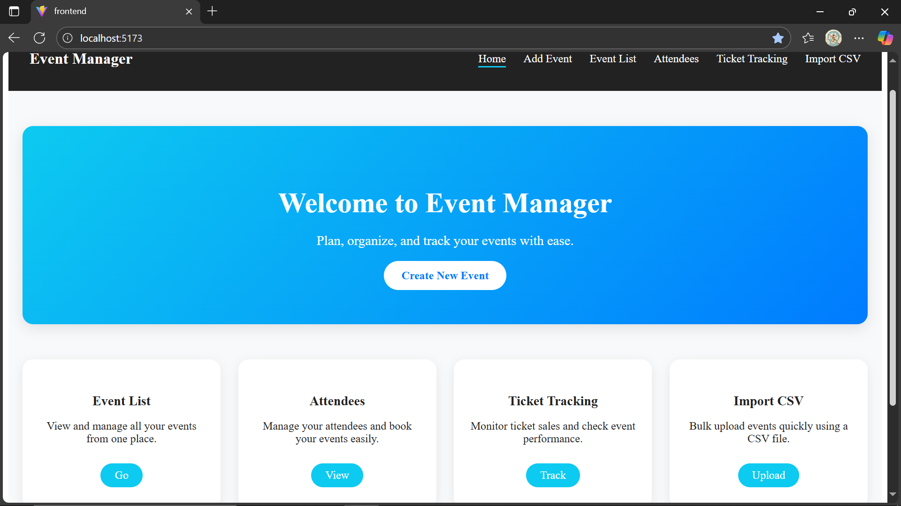
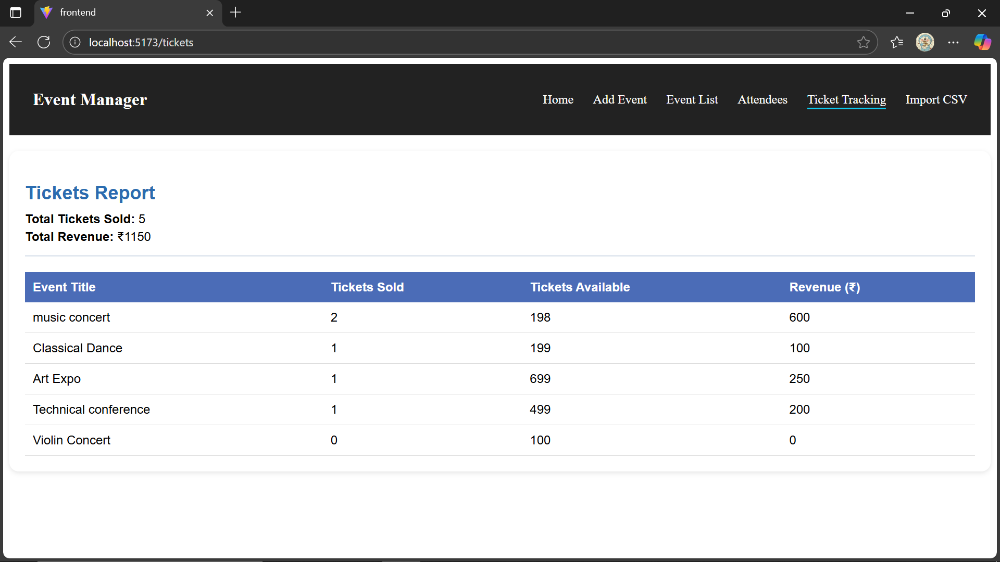
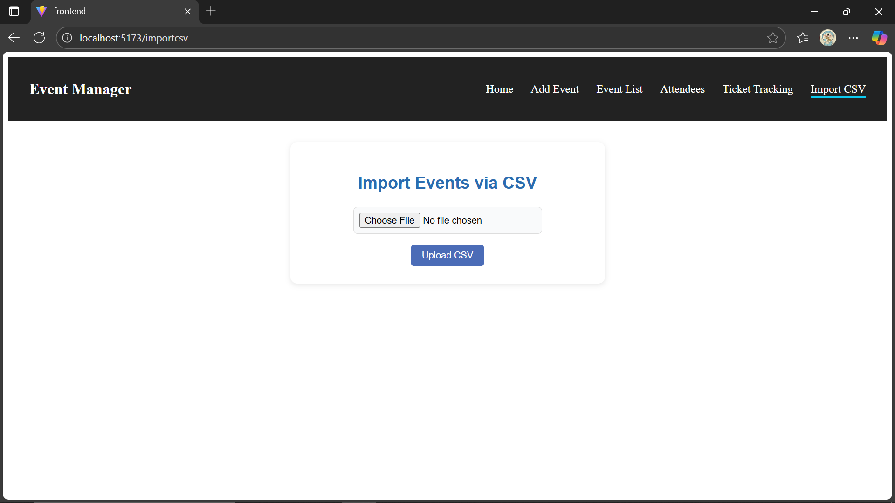

# Event Management System

A full-stack web application to manage events, attendees, ticket sales, and import event data via CSV. Built using **React** for frontend and **Flask + SQLAlchemy** for backend.

--- 

## **Features**

### Event Management
Create new events with:
 -Title, Description, Date & Time, Location, Capacity
Update and delete existing events
Search events by title or date
View all events in a table/list view with edit/delete options

### Attendee Management
Register attendees to an event (Name + Email)
Prevent duplicate registrations for the same event
View all attendees for each event

### Ticket Tracking
Track tickets sold and available per event
Generate ticket sales and revenue reports

### CSV Import
Import events in bulk using a CSV file
Fields: Event Title, Description, Date, Location, Capacity

---

## **Tech Stack**

- **Frontend:** React, React Router, Axios, Lucide icons, CSS
- **Backend:** Flask, SQLAlchemy, SQLite/PostgreSQL
- **Others:** CSV parsing, REST API

---

## **Project Structure**
frontend/ - React app
  src/
    components/ - UI components like Navbar, EventForm, EventList, AttendeeForm
    App.jsx - Main app routing
    
backend/ - Flask API
  routes/ - API endpoints for events, attendees, tickets, CSV import
  models.py - Database models
  database.py - DB connection
  app.py - Flask app setup
 
## Screenshots

**Home Page**  

**Event Form**  

**Event List**  

**Attendee** 

**Ticket Tracking**  

**CSV Upload**  

